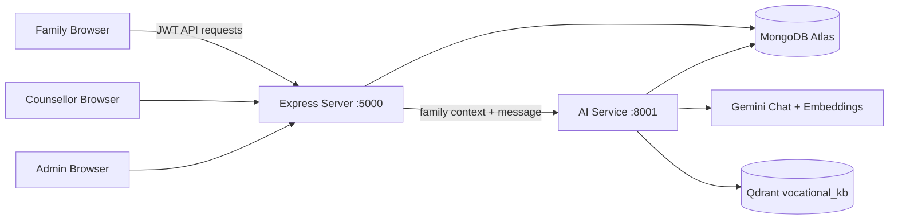
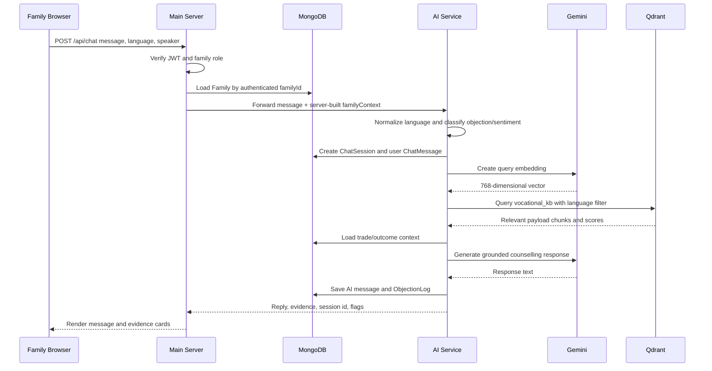

# KaushalSaarthi Platform Guide

## 1. Platform Overview

KaushalSaarthi is an AI-enabled career counselling and family decision-support platform for Smart India Hackathon problem statement 26241 from the Ministry of Skill Development and Entrepreneurship.

The platform treats the family, not only the learner, as the counselling user. A learner and parent can ask questions together, switch the current speaker, compare vocational trades, view outcome data, understand skill progression, and request a human counsellor.

The platform addresses five core concerns:

- Income and earning potential
- Job security and placement
- Social status and comparison with degree routes
- Safety and training quality
- Further education and career progression

The central product principle is:

> Explain vocational choices with simple language, verified outcome data, and a clear path to human support.

---

## 2. How It Maps to PS26241

| Problem statement requirement | KaushalSaarthi implementation |
| --- | --- |
| Engage learners and parents jointly | Family chat with Parent/Learner speaker toggle |
| Regional-language counselling | English, Marathi, and Hindi interface controls; language-aware retrieval |
| Address parental objections | Objection classification for income, job security, social status, safety, cost, education, and training |
| Present local outcome data | Trade, Provider, and OutcomeStat models with district/provider/year fields |
| Explain qualification to career growth | Skill-level explainer and trade career ladder |
| Human escalation | Counsellor directory, contact preference form, escalation queue, outcomes |
| Administrator visibility | Resistance dashboard with district, objections, sentiment, and CSV export |
| Low-literacy design | Large controls, short copy, icons, voice input, speech output, simple cards |
| No fabricated figures | Retrieved evidence, sample labels, verified-data rules, and grounded fallback response |

---

## 3. High-Level Architecture



### Services

| Service | Location | Port | Responsibility |
| --- | --- | --- | --- |
| React client | `client/` | Vite, normally 5173 | Family, counsellor, admin, login, trade, and chat UI |
| Main server | `server/` | 5000 | JWT auth, family profiles, trades, outcomes, counsellors, escalations, insights |
| AI service | `ai-service/` | 8001 | Gemini generation, embeddings, Qdrant retrieval, chat persistence, escalation detection |
| MongoDB Atlas | External | Cloud | Users, families, trades, providers, outcomes, chats, objections, escalations |
| Qdrant Cloud | External | Cloud | Vector collection `vocational_kb` |

The root command starts the three application services:

```powershell
npm start
```

This runs:

```text
server   -> npm run dev
client   -> npm run dev
ai       -> npm run dev
```

The old Python ML service is no longer part of the KaushalSaarthi startup flow.

---

## 4. User Roles

### Family

A family account represents the learner and parent decision unit. It stores minimal context used to personalize explanations:

- Learner name
- Parent name
- Phone
- District and state
- Rural, semiurban, or urban area type
- Household income bracket
- Learner education level
- Learner interests
- Preferred language
- Consent state

Family capabilities:

- Complete onboarding
- View family home
- Explore trades
- Read skill-level explanations
- Chat as parent or learner
- Request a counsellor
- View outcome evidence cards

### Counsellor

Counsellors receive family cases that match their district and languages. They can:

- View open family escalations
- See district, language, objection category, and summary
- Move cases from open to in progress or resolved
- Record outcomes such as convinced, partially convinced, not convinced, or no response
- Add counsellor notes

### Administrator

Administrators can:

- View resistance metrics
- Filter by district
- Inspect objection mix
- Review sentiment shift
- View open escalations
- Export insight sessions as CSV
- Upload outcome datasets

Legacy mentor/student roles remain in the repository during migration compatibility, but the target product workflow is family, counsellor, and administrator.

---

## 5. Frontend Experience

### Public pages

- `/` - KaushalSaarthi landing page
- `/login` - login with real demo-account selector
- `/register` - family onboarding wizard
- `/explore-careers` - trade explorer
- `/trades/:id` - trade detail and outcome page
- `/pathway` - skill-level and career progression explainer

### Family pages

- `/family` - family career home
- `/chat` - joint family counselling chat
- `/counsellors` - district/language-aware counsellor request flow

### Counsellor and admin pages

- `/counsellor` - family-aware escalation queue
- `/mentor/escalations` - shared legacy-compatible escalation queue
- `/admin` - resistance dashboard

### UI direction

The family-facing visual system uses:

- Warm neutral background: `#f6f1e8`
- Dark slate ink for readable hierarchy
- Amber for primary action and progression
- White surfaces with restrained borders
- Large touch targets
- Short descriptions
- Icons paired with clear labels
- Rounded cards used only for real interaction objects
- Explicit sample-data labels

The shared dashboard shell has also been moved toward this system so public, family, counsellor, and admin screens feel like one product.

---

## 6. Family Onboarding Flow

1. Select language: English, Marathi, or Hindi.
2. Select who is using the platform: learner, parent, or both.
3. Select district and area type.
4. Select learner education level.
5. Optionally select household income bracket.
6. Enter learner name, parent name, phone, username, and password.
7. Accept the plain-language consent statement.
8. The client sends `role: family` registration data to the server.
9. The server creates both a `User` document and a `Family` document.
10. Login state is stored in local storage and the user is routed to `/family`.

The client never supplies trusted family context to the AI directly. The main server loads the authenticated family record and constructs the context server-side.

---

## 7. Family Chat Execution Flow



### Main server request handling

The main route is `server/routes/chat.js`.

For a family request it:

1. Requires a valid JWT.
2. Requires role `family`.
3. Loads the family using `req.user.familyId`.
4. Builds a `studentContext` compatibility object containing family fields.
5. Sends the message, speaker, language, and context to the AI service.
6. Returns the AI response to the client.

This server-side context construction prevents a browser from pretending to be another family.

### AI-service request handling

The main AI route is `ai-service/routes/chat.js`.

It:

1. Normalizes display language values to `en`, `mr`, or `hi`.
2. Classifies the objection category with multilingual keyword patterns.
3. Estimates sentiment from simple local positive/negative signals.
4. Creates or loads the chat session.
5. Stores the user message with speaker, language, objection, and sentiment.
6. Retrieves relevant knowledge and outcome context.
7. Builds the evidence-oriented system prompt.
8. Calls Gemini for the response.
9. Stores the AI message.
10. Writes an `ObjectionLog` for family analytics.
11. Updates session start/latest sentiment.
12. Returns evidence and escalation metadata.

If Gemini is temporarily unavailable, the route creates a grounded fallback response using only retrieved payload text. This keeps the demo usable while avoiding invented numbers.

---

## 8. RAG System

RAG means Retrieval-Augmented Generation. KaushalSaarthi uses retrieval to supply relevant vocational evidence to the language model before asking Gemini to write the response.

### Ingestion flow

The ingestion script is:

```text
ai-service/ingest.js
```

It:

1. Connects to the configured Qdrant cluster.
2. Deletes and recreates the `vocational_kb` collection.
3. Creates a keyword payload index for `language`.
4. Reads:
   - `server/data/demo_trades.csv`
   - `server/data/demo_outcomes.csv`
5. Builds a text representation of each trade/outcome row.
6. Requests a Gemini embedding using `gemini-embedding-001`.
7. Requests 768-dimensional vectors for Qdrant compatibility.
8. Stores points with payload fields such as:

```json
{
  "topic": "Electrician",
  "type": "outcome",
  "language": "en",
  "text": "Outcome Data for Trade...",
  "source": "Demo Dataset"
}
```

9. Uploads the points to Qdrant.

Current demo ingestion creates 22 English trade/outcome chunks. Marathi and Hindi retrieval requests fall back to English because localized source chunks have not yet been ingested.

### Retrieval flow

The retrieval helper is:

```text
ai-service/services/qdrant.js
```

For each query it:

1. Normalizes the requested language.
2. Creates a Gemini embedding for the user message.
3. Queries Qdrant using the installed SDK `query()` method.
4. Applies a payload filter for the requested language.
5. Returns up to five relevant points.
6. Falls back to English if Marathi or Hindi has no matching chunks.

The collection requires the `language` keyword payload index. Without that index, Qdrant returns a bad request for filtered retrieval.

### Anti-hallucination rule

The system prompt tells Gemini:

- Use retrieved evidence for factual claims.
- Never invent salary or placement numbers.
- State when verified data is unavailable.
- Offer a counsellor when the answer cannot be grounded.
- Keep responses short and simple.

The client renders the retrieved evidence as an evidence card. Every displayed sample statistic is visibly labelled as sample data.

### Current RAG limitation

The current chat route still combines Qdrant results with the existing legacy `OutcomeData` collection for compatibility. The canonical new APIs use `OutcomeStat`. A later cleanup should make the AI service read `OutcomeStat` directly so all outcome numbers share one schema and verification contract.

---

## 9. Gemini Integration

The adapter is:

```text
ai-service/services/gemini.js
```

It exports:

- `generateChat(messages, systemPrompt)`
- `generateEmbedding(text)`
- `generateJSON(messages, systemPrompt, schema)`

Configuration is read from environment variables:

```env
GEMINI_API_KEY=...
GEMINI_CHAT_MODEL=gemini-3.8-flash
GEMINI_EMBED_MODEL=gemini-embedding-001
EMBEDDING_DIM=768
GEMINI_TIMEOUT_MS=25000
```

The adapter includes:

- API-key validation
- Request timeout
- One retry for 429 and 5xx responses
- JSON response parsing for structured model output
- 768-dimensional embedding configuration

A separate direct test confirmed Marathi generation works with the current Gemini key.

---

## 10. Data Model Overview

### User

Stores authentication and role information:

- `username`
- `passwordHash`
- `role`
- `familyId`
- `counsellorCode`
- `languages`
- `districts`
- `phone`

### Family

Stores the counselling context:

- `familyId`
- `learnerName`
- `parentName`
- `phone`
- `district`
- `state`
- `areaType`
- `incomeBracket`
- `learnerEducation`
- `learnerInterests`
- `preferredLanguage`
- `consentGiven`
- `isSynthetic`

### Trade

Stores career information:

- `tradeId`
- `name`
- `sector`
- `nsqfLevel`
- `durationMonths`
- `minEligibility`
- `jobRoles`
- `progression`
- `safetyNotes`
- `furtherEducation`

### Provider

Stores training-provider information:

- `providerId`
- `name`
- `type`
- `district`
- `state`
- `address`
- `contactPhone`
- `tradesOffered`
- `fees`
- `verified`

### OutcomeStat

Stores trade/provider/district/year outcome data:

- `tradeId`
- `providerId`
- `district`
- `state`
- `year`
- `batchSize`
- `placementRatePct`
- `avgStartingSalaryMonthly`
- `salaryMin`
- `salaryMax`
- `avgSalaryAfter3YrsMonthly`
- `selfEmployedPct`
- `higherStudyPct`
- `source`
- `verified`
- `datasetVersion`

### ChatSession

Stores conversation-level analytics:

- `familyId`
- `language`
- `tradeFocusId`
- `startSentiment`
- `latestSentiment`
- `finalFeeling`
- `escalated`
- `district`
- `isSynthetic`

### ChatMessage

Stores each turn:

- `chatSessionId`
- `role`
- `content`
- `speaker`
- `language`
- `objectionCategory`
- `sentiment`
- `dataUsed`
- `lowConfidence`
- `isSynthetic`

### ObjectionLog

Stores resistance analytics:

- `chatSessionId`
- `messageId`
- `familyId`
- `district`
- `tradeId`
- `speaker`
- `category`
- `sentiment`
- `resolved`
- `isSynthetic`

### Escalation

Stores human handoff cases:

- `familyId`
- `reason`
- `objectionCategory`
- `preferredContact`
- `phone`
- `preferredTime`
- `language`
- `summary`
- `status`
- `outcome`
- `counsellorNotes`
- `isSynthetic`

---

## 11. Main API Surface

### Authentication

```text
POST /api/auth/register
POST /api/auth/login
```

Family login accepts username, email, or phone.

### Family

```text
GET /api/families/me
PUT /api/families/me
```

### Trades and outcomes

```text
GET /api/trades
GET /api/trades/:id?district=Nashik
GET /api/providers?district=Nashik&tradeId=electrician
GET /api/outcomes?tradeId=electrician&district=Nashik
POST /api/outcomes/upload
```

The trade detail endpoint returns:

- Trade information
- Latest outcome rows
- Weighted aggregate statistics
- District/state scope
- Fallback indicator
- Nearby providers

### Family chat and escalation

```text
POST /api/chat
POST /api/chat/escalate
GET /api/counsellors
POST /api/counsellors/request
```

### Admin insights

```text
GET /api/insights/overview
GET /api/insights/by-district
GET /api/insights/by-objection
GET /api/insights/export.csv
```

All insight endpoints require the administrator role.

---

## 12. Admin Resistance Metrics

The resistance dashboard uses stored family sessions, objection logs, and escalations.

Current metrics include:

- Total families
- Chat sessions
- Open escalations
- Hopeful ending percentage
- Average sentiment shift
- Objection mix
- District resistance index
- District session counts
- CSV export

The current district resistance calculation uses negative starting sentiment and worried endings:

```text
resistance index =
  0.7 x percentage of negative-start sessions
  + 0.3 x percentage of worried-ending sessions
```

The value is displayed on a 0 to 100 scale.

Synthetic records are clearly labelled so judges know the dashboard is demonstrating the workflow rather than claiming official engagement statistics.

---

## 13. Synthetic Demo Data

The clean demo database is populated in two stages.

### Core sample data

```powershell
cd server
npm run seed:kaushal
```

Creates:

- 10 trades
- 12 providers
- 180 outcome-stat rows
- 3 real demo family profiles
- Admin, counsellor, and family demo accounts

### Synthetic engagement data

```powershell
cd server
npm run seed:synthetic
```

Creates:

- 60 synthetic families
- 450 synthetic sessions
- 900 messages
- 450 objection logs
- 41 escalations

Running `seed:synthetic` again removes only previously synthetic records and recreates them deterministically. It does not remove the core family/trade/outcome records.

---

## 14. Demo Credentials

All demo passwords are:

```text
demo1234
```

Accounts:

```text
Family Marathi:  fam-001@demo.local
Family English:  fam-002@demo.local
Counsellor:      counsellor1@msde.demo
Counsellor:      counsellor2@msde.demo
Administrator:   admin@msde.demo
```

The login screen includes a demo-account selector that fills credentials automatically.

---

## 15. Three-Minute Demo Flow

1. Open the login page.
2. Select `Family - Marathi` from the demo selector.
3. Open the family home.
4. Open family chat.
5. Switch the speaker to Parent.
6. Ask in Marathi:

```text
ITI karun kay milnar? Degree changli nahi ka?
```

7. Show the grounded AI response and evidence card.
8. Switch the speaker to Learner.
9. Ask about interest in electrical work or vehicles.
10. Open Explore Trades.
11. Open a trade detail page.
12. Show placement, salary range, sample-data label, providers, and career ladder.
13. Open the counsellor page.
14. Request a call or WhatsApp support.
15. Sign out.
16. Sign in as the counsellor.
17. Show the family case queue and outcome selector.
18. Sign in as administrator.
19. Show district resistance, objection mix, sentiment shift, and synthetic-data label.
20. Export the dashboard CSV.

---

## 16. Privacy and Safety

The platform should follow these rules in deployment:

- Never commit `.env` files or API keys.
- Rotate credentials if they have been exposed.
- Use HTTPS in production.
- Restrict CORS to the deployed client URL.
- Keep family data minimal.
- Require consent before storing family context.
- Scope family APIs to the authenticated family ID.
- Do not expose one family’s chat to another family.
- Label sample and synthetic records clearly.
- Do not present sample placement or salary numbers as official MSDE statistics.
- Escalate distress or unresolved concerns to a human counsellor.

---

## 17. Current Limitations

The current implementation is demo-ready, but these items should be addressed before production:

1. The sample outcome data must be replaced or verified against official MSDE/NSDC/DGT data.
2. Current Qdrant ingestion contains English trade/outcome chunks; Marathi and Hindi-specific KB chunks should be added.
3. Voice recognition and Marathi text-to-speech availability depends on the browser and device.
4. The AI service retains some legacy `OutcomeData` compatibility code; it should eventually use `OutcomeStat` exclusively.
5. The admin dashboard currently relies on synthetic engagement records for a populated demonstration.
6. Production deployment needs rate limiting, message caps, structured logging, monitoring, and stronger input validation.
7. Full end-to-end testing should cover role security, no-data questions, multilingual escalation, and mobile accessibility.

---

## 18. Why This Is a Strong PS26241 Solution

KaushalSaarthi is differentiated from a generic career chatbot because it combines:

- The family as the primary decision unit
- Localized vocational outcome evidence
- Parent and learner perspectives in the same conversation
- A visible career progression ladder
- A real counsellor handoff loop
- Objection and sentiment analytics for administrators
- Explicit anti-hallucination behavior
- Transparent sample-data and synthetic-data labels

The pitch should focus on the insight that vocational participation is not only a learner decision. It is a family decision shaped by trust, status, safety, income, and perceived future opportunity.
